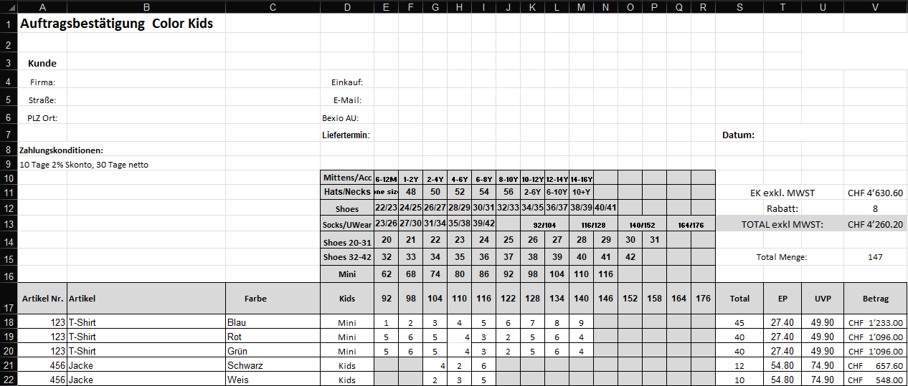

#  Bexio Order Importer

An automated, enterprise-ready utility to parse complex Excel order forms, transform the data, and import customer metadata and order positions directly into the Bexio REST API.

The project features a modern, clean **WPF Desktop Application** built following MVVM principles (using a custom Nordic Minimalist style, blur backdrops, and interactive animations), as well as a **Command Line Interface (CLI)** for automated batch processing.

---

## Documentation

- 📖 **[User Manual](doc/UserManual.md)**: A comprehensive guide detailing the application's configuration, imports, matrix-mapping concepts, and updates.
- 🛠️ **[Contributing Guidelines](CONTRIBUTING.md)**: Information about repository rules, C# formatting, and pull request validations.

---

## Key Features

- **Excel Parsing**: Fully automated extraction of complex order forms containing size matrices using [ClosedXML](https://github.com/ClosedXML/ClosedXML).
- **Interactive WPF GUI**:
  - **Premium Nordic Design**: Borderless windows, custom shadows, and dynamic focus-synced backdrop overlays.
  - **Drag-and-Drop File Upload**: Interactive drop card displaying file names, sizes, and a hover-based trashcan action.
  - **Interactive Preview & Edit**: Modify parsed quantities and prices directly in the grid before submitting.
  - **Totals & Discount Panel**: Computes gross amounts, parsed discount %, discount amounts, and net totals dynamically.
  - **Live API Indicator**: Visual Red/Yellow/Green connection status light.
  - **API Token Masking**: Securely hides your token as dots (`••••••••`) when the field loses focus; clicking inside reveals it immediately.
  - **Dynamic Account & Tax Selectors**: Bookkeeping accounts and VAT rates are fetched directly from Bexio APIs and displayed as searchable dropdowns once connected.
  - **Connection Reconnect Button**: Retry establishing connection and refreshing options easily when connection is lost.
  - **Completely Localized**: German and English language support out of the box.
- **Bexio API Integration**:
  - Searches contacts dynamically by email.
  - Interactive validation card to review and update new customer details before automatic DB insertion.
  - Generates draft orders mapping correct catalog articles, accounting books, and tax rates.
  - Strict article validation: If an article is not found by article number in Bexio, the import is immediately aborted and an error is shown.
- **Auto-Updater & Settings Preservation**:
  - Automatically queries the GitHub Releases API on launch.
  - In-app download card with real-time download progress.
  - Triggers a low-privilege silent background installer (`/SILENT`), closes the active process, updates, and restarts.
  - **Settings Preservation**: User profiles and API keys are stored in `%LocalAppData%\BexioOrderImport\appsettings.json`, remaining fully intact across updates.
- **Enterprise CI/CD & Automated Testing**:
  - Automated PR builds and test runs on GitHub Actions.
  - Code coverage reporting printed directly in the GitHub Run Summary.
  - Dedicated local script (`./build/run-coverage.ps1`) to run tests and automatically generate and open an interactive HTML coverage report.

---

## Understanding the Excel Matrix Layout

The importer parses order spreadsheets where article metadata extends horizontally, but quantities are distributed vertically as a matrix corresponding to custom size headers.

Below is the template layout supported by the default mapping configuration:



_Detailed information on coordinate mapping coordinates can be found in the **[User Manual](doc/UserManual.md)**._

---

## Codebase Structure

The solution is built following Clean Architecture practices and separated into:

```
src/
├── BexioOrderImport.Domain/          # Domain models (Order, Customer, OrderPosition)
├── BexioOrderImport.Application/     # Core business logic & interfaces (UseCases, Interfaces)
├── BexioOrderImport.Infrastructure/  # External integrations (Bexio REST Client, ClosedXML Parser)
├── BexioOrderImport.Cli/             # Console CLI application
├── BexioOrderImport.Wpf/             # WPF Desktop App (MVVM views, custom dialogs, styles)
└── BexioOrderImport.Tests/           # Unit and VM tests (28 test cases, xUnit & Coverlet)
```

---

## Getting Started

### Prerequisites

- **.NET SDK 10.0** or higher
- Windows 10/11 (required to run the WPF GUI)
- [Inno Setup 6](https://jrsoftware.org/isinfo.php) (optional, if you wish to compile the installer locally)

### Build & Run

1. **Clone the repository**:

   ```bash
   git clone https://github.com/nilsthomann/bexio-order-import.git
   cd bexio-order-import
   ```

   Restore dotnet local tools and initialize local git hooks (managed by [Husky.NET](https://github.com/alirezanet/Husky.Net)):

   ```bash
   dotnet tool restore
   dotnet husky install
   ```

2. **Build the solution**:

   ```bash
   dotnet build BexioOrderImport.slnx
   ```

3. **Run unit tests**:

   ```bash
   dotnet test BexioOrderImport.slnx
   ```

   To collect code coverage and view the HTML report locally:

   ```powershell
   ./build/run-coverage.ps1
   ```

4. **Launch the WPF GUI**:
   ```bash
   dotnet run --project src/BexioOrderImport.Wpf/BexioOrderImport.Wpf.csproj
   ```

---

## Configuration Template

Configuration is stored in `%LocalAppData%\BexioOrderImport\appsettings.json`. In the WPF GUI, these settings can be configured comfortably in the **Settings** tab.

```json
{
  "Bexio": {
    "ApiToken": "bexio_api_token_here",
    "AccountId": null,
    "TaxId": null,
    "Language": "de"
  },
  "ActiveProfileName": "Default",
  "Profiles": [
    {
      "Name": "Default",
      "ExcelMapping": {
        "WorksheetIndex": 1,
        "PositionTextTemplate": "Color: {Color}, Size: {Size}",
        "Header": {
          "CompanyNameCell": "B4",
          "StreetCell": "B5",
          "ZipCityCell": "B6",
          "BuyerEmailCell": "E5",
          "BuyerNameCell": "E4",
          "OrderIdCell": "E6",
          "PaymentTermsCell": "A9",
          "DiscountCell": "V12"
        },
        "SizeMatrix": {
          "StartRow": 10,
          "EndRow": 17,
          "CategoryColumn": 4,
          "StartSizeColumn": 5,
          "EndSizeColumn": 18
        },
        "Data": {
          "StartRow": 18,
          "ArticleNumberColumn": 1,
          "ArticleNameColumn": 2,
          "ColorColumn": 3,
          "CategoryColumn": 4,
          "StartQtyColumn": 5,
          "EndQtyColumn": 18,
          "UnitPriceColumn": 20
        }
      }
    }
  ]
}
```

### Profile System

The WPF app supports multiple **Excel Mapping Profiles**. Each profile stores a complete set of cell/column configuration for a different Excel template format. You can:

- **Create** a new profile from scratch
- **Clone** an existing profile and adjust individual cells
- **Edit** a profile via the built-in profile editor dialog
- **Set Active** – the active profile is used when loading Excel files
- **Export** all profiles to a portable JSON file
- **Import** profiles from a JSON file (useful to share configurations between machines)

Profiles are managed on the **Settings tab** in the WPF app.

---

## License

This project is licensed under the MIT License - see the [LICENSE](LICENSE) file for details.